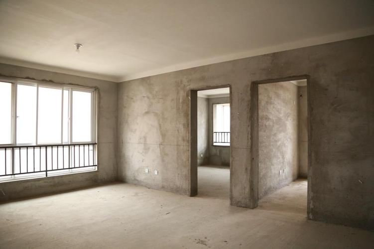
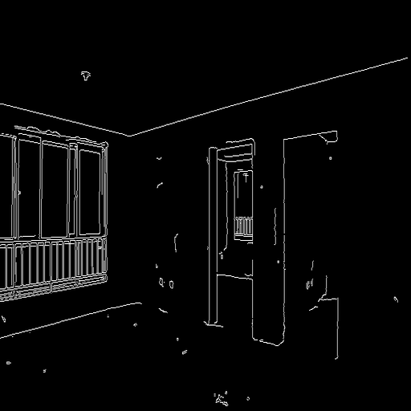
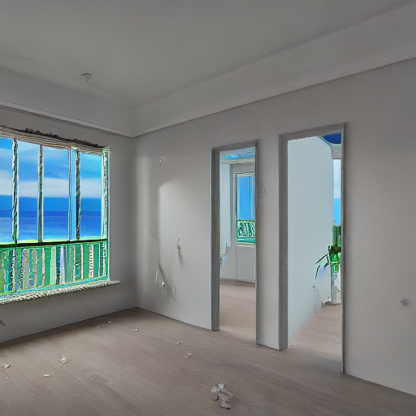

#### ControlNet生成图片
##### Colab教程

[](https://colab.research.google.com/github/liweiwp/OpenMMLabCamp/blob/main/mmlab2/mmagic/controlnet.ipynb)

##### 毛坯房图



##### 边缘检测图



##### 咒语
```python
prompt = 'all new room with window facing sea'
```

##### ControlNet生成图

