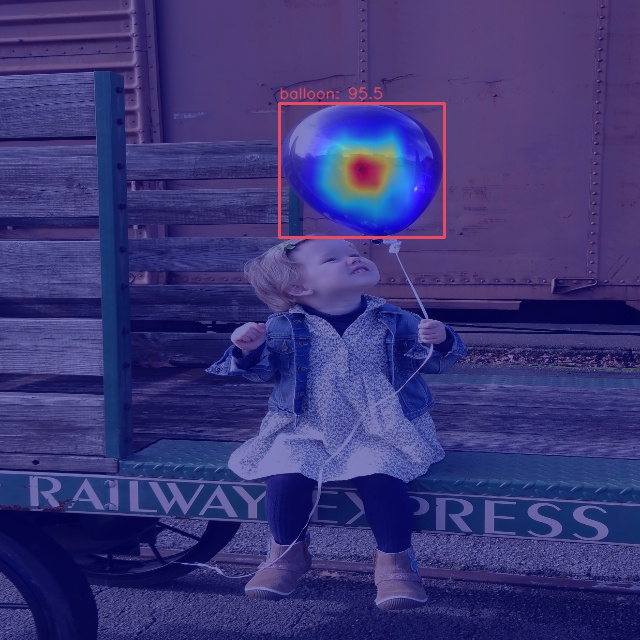

#### 气球检测
##### Colab教程

[](https://colab.research.google.com/github/liweiwp/OpenMMLabCamp/blob/main/mmlab2/mmdet/rtmdet_balloon.ipynb)

##### 生成coco格式标注文件

```shell
python via2coco.py
```

##### 微调训练

```shell
python tools/train.py rtmdet_tiny_1xb12-40e_balloon.py
```
| config   | checkpoint | log | mAP|
|:--------:|:----------:|:---------:|:---------:|
| rtmdet_tiny_1xb12-40e_balloon.py| best_coco_bbox_mAP_epoch_30.pth| 20230610_052939/20230610_052939.log| 70.1|

##### 测试
```shell
python tools/test.py \
    rtmdet_tiny_1xb12-40e_balloon.py \
    work_dirs/rtmdet_tiny_1xb12-40e_balloon/best_coco_bbox_mAP_epoch_30.pth
```


##### 可视化

```shell
python demo/boxam_vis_demo.py \
    resized_image.jpg \
    ../mmdetection/rtmdet_tiny_1xb12-40e_balloon.py \
    ../mmdetection/work_dirs/rtmdet_tiny_1xb12-40e_balloon/best_coco_bbox_mAP_epoch_30.pth \
    --target-layer neck.out_convs[1]
```


