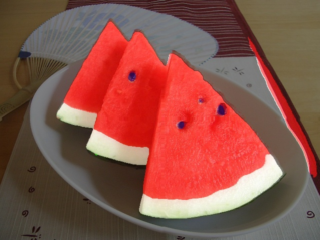

#### 西瓜语义分割
##### Colab教程

[](https://colab.research.google.com/github/liweiwp/OpenMMLabCamp/blob/main/mmlab2/mmseg/pspnet_watermelon/pspnet_watermelon.ipynb)

##### 西瓜数据集

```shell
# fix dataset error
mv data/Watermelon87_Semantic_Seg_Mask/img_dir/train/21746.1.jpg data/Watermelon87_Semantic_Seg_Mask/img_dir/train/21746.jpg
mv data/Watermelon87_Semantic_Seg_Mask/img_dir/val/01bd15599c606aa801201794e1fa30.jpg@1280w_1l_2o_100sh.jpg data/Watermelon87_Semantic_Seg_Mask/img_dir/val/01bd15599c606aa801201794e1fa30.jpg
```

##### 训练

```shell
python tools/train.py pspnet_r50_watermelon.py
```
| config   | checkpoint | log | aAcc| mIoU| mAcc|
|:--------:|:----------:|:---------:|:---------:|:---------:|:---------:|
| pspnet_r50_watermelon.py| iter_800.pth| 20230617_131509.log| 90.51| 62.12| 73.53|

##### 测试
```shell
python tools/test.py pspnet_r50_watermelon.py work_dirs/pspnet_r50_watermelon/iter_800.pth
```

##### 可视化

```shell
python demo/image_demo_with_inferencer.py \
    data/Watermelon87_Semantic_Seg_Mask/img_dir/val/17897490_93d9666602_z.jpg \
    pspnet_r50_watermelon.py \
    --checkpoint work_dirs/pspnet_r50_watermelon/iter_800.pth \
    --device cuda:0 --out-dir result
```

